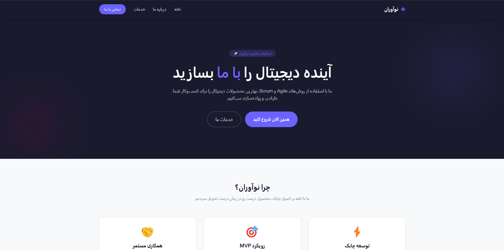
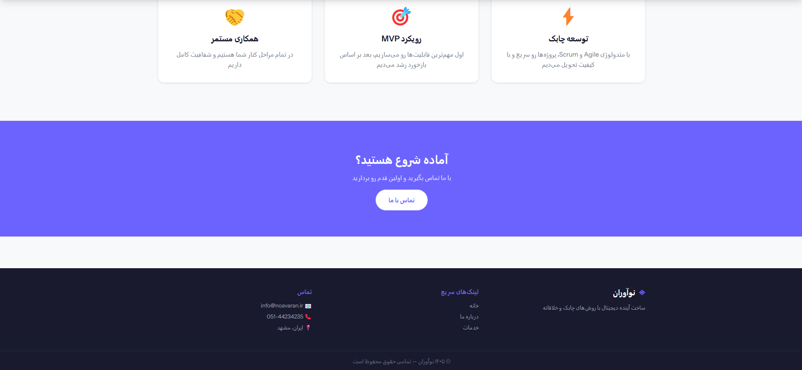
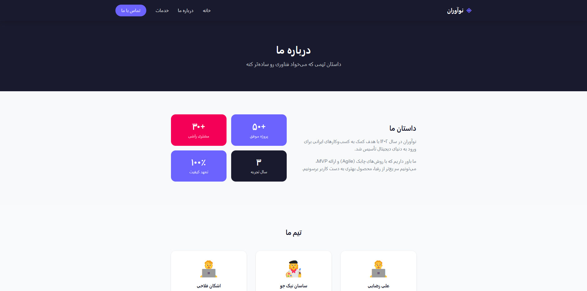
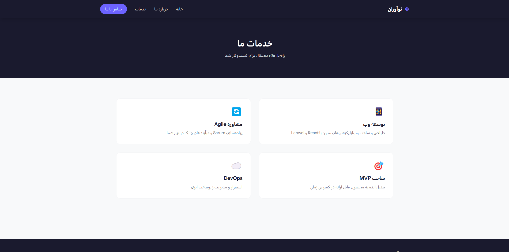
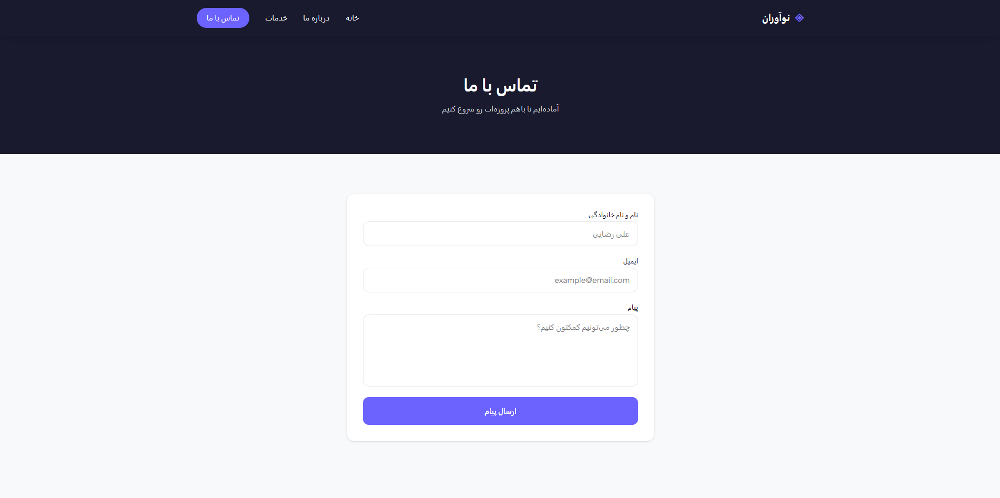

# ◈ Noavaran — Digital Platform

A modern web application built with Laravel and React, designed as an MVP (Minimum Viable Product) for a technology startup.

---

## 📸 Screenshots

### Home Page



### About Page


### Services Page


### Contact Page


---

## 🛠️ Tech Stack

| Layer | Technology |
|---|---|
| Backend | Laravel 11 |
| Frontend | React 18 + TypeScript |
| Bridge | Inertia.js |
| Styling | Tailwind CSS v4 |
| Build Tool | Vite |
| Local Environment | Laravel Herd |
| Version Control | Git + GitHub |

---

## 📐 Architecture

This project uses a **Monolithic + SPA** architecture:

- **Laravel** handles server-side logic, routing, and data delivery
- **Inertia.js** acts as the bridge between Laravel and React
- **React** handles client-side rendering
- **Tailwind CSS v4** provides styling with a custom design system

---

## 🎨 Design System & Brand

Brand colors are defined in `resources/css/app.css` using the `@theme` directive in Tailwind v4:

| Name | Hex | Usage |
|---|---|---|
| Primary | `#6C63FF` | Buttons, links, highlights |
| Secondary | `#F50057` | Accents and emphasis |
| Brand Dark | `#1A1A2E` | Navbar, Footer, dark backgrounds |
| Muted | `#6B7280` | Secondary text |

Primary font: **Vazirmatn** (with Persian language support)

---

## 🚀 Pages

- **/** — Home (Hero, Features, CTA)
- **/about** — About Us (Story, Stats, Team)
- **/services** — Services (Service list)
- **/contact** — Contact (Contact form)

---

## 💡 Development Methodology

### Agile
The project was developed following Agile principles — instead of planning everything upfront, work was broken into small increments and delivered iteratively.

### Scrum
Work was structured around Sprints:
- **Sprint 1** — Project setup and development environment configuration
- **Sprint 2** — Design system, color palette, and shared Layout
- **Sprint 3** — Implementation of all public pages

### MVP
This project is a true MVP — only the essential public-facing pages have been implemented. More advanced features (authentication, admin panel, API) will be added in future sprints.

---

## ⚙️ Installation

**Prerequisites:**
- PHP 8.2+
- Node.js 20+
- Laravel Herd
- Composer

**Steps:**

```bash
# Clone the repository
git clone https://github.com/USERNAME/my-startup.git
cd my-startup

# Install dependencies
composer install
npm install

# Set up environment
cp .env.example .env
php artisan key:generate

# Run the project
npm run dev
```

The site will be available at `http://my-startup.test`

---

## 📁 Project Structure

```plaintext
resources/js/
├── layouts/
│   └── MainLayout.tsx     # Shared layout (Navbar + Footer)
├── pages/
│   ├── home.tsx           # Home page
│   ├── about.tsx          # About page
│   ├── services.tsx       # Services page
│   └── contact.tsx        # Contact page
app/Http/Controllers/
└── PageController.php     # Page routing controller
```

---

## 👤 Developer — Sasan Nikjoo

Built with ❤️ for Iran Server